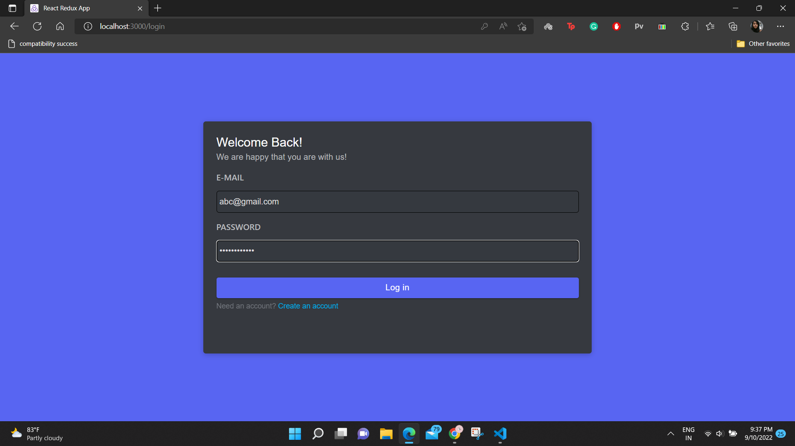
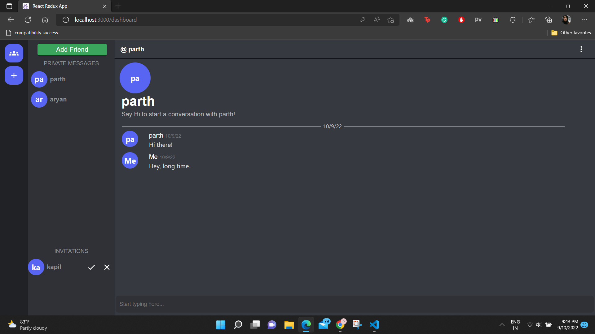
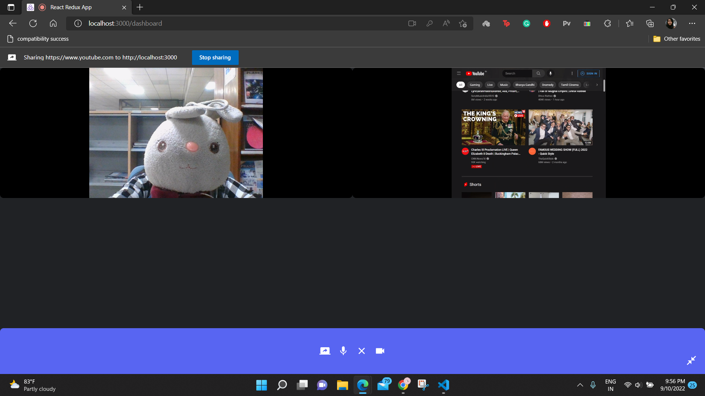

# Discord-Clone

The Front-end Code of Discord-Clone with various features like screen sharing, realtime chatting, audio and video calls.
All of this, just supported in group calls too.

Built with React along with Redux to power front-end.
## Tech Stack

**Client:** React, Redux, Simple-Peer, Socket.IO


## Features

- Login/Registration using JWT Token
- Users can send, accept or decline friends invitations.
- Realtime Chat functionality
- Audio and Video group calls possible
- Create, Join and Leave Rooms anytime.
- Screen Share feature available on group calls.


## Run Locally

Clone the project

```bash
  git clone https://github.com/Saloniaga/my_discord_front.git

Install dependencies

```bash
  npm install --save
  npm start
```
## Screenshots

The Login & Register Page.



The homepage has a sidebar with the list of your friends and the pending friends invitation.



A user can create a room where maximun 4 people can join. It has audio, video and screen share options.



